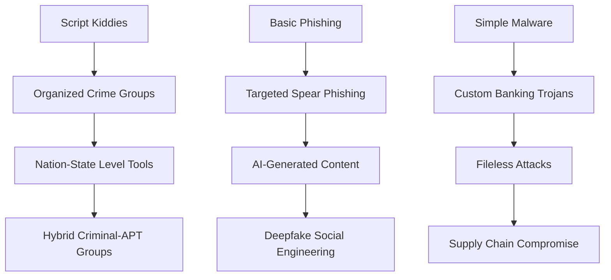

# Fraud Detection Resources
*Comprehensive learning path from zero to hero in anti-fraud systems*

[](https://opensource.org/licenses/MIT)
[](CONTRIBUTING.md)
[](https://github.com/yourusername/fraud-detection-resources/stargazers)

**Based on the technical presentation at BSides Querétaro 2025: "Termodinámica del Fraude"**

## What you'll learn

- Build production-ready fraud detection systems from scratch
- Master Graph Neural Networks for network analysis
- Implement real-time detection APIs
- Understand threat actor TTPs and attribution
- Deploy MLOps pipelines for fraud detection

## De zero a hero en detección de fraude y análisis de ciberactores

---

## Tabla de contenidos

### Parte I: Sistema anti-fraude (lo principal)

1. Roadmap de aprendizaje
2. Papers esenciales
3. Herramientas y código
4. Datasets para práctica
5. Arquitecturas de referencia
### Parte II: Threat actors y ciberactores (recursos extra)

6. Análisis de threat actors
7. Threat intelligence
8. Técnicas de ataque evolutivas
### Parte III: Recursos avanzados

9. Cursos y certificaciones
10. Labs hands-on
11. Comunidades y eventos

---

## Roadmap de aprendizaje {#roadmap-aprendizaje}

### Nivel 1: Fundamentos (semanas 1-4)

#### Matemáticas y estadística base

- **Linear algebra**:    
    - Khan Academy Linear Algebra
    - 3Blue1Brown Essence of Linear Algebra
- **Statistics & probability**:
    - Think Stats (free PDF)
    - Introduction to Statistical Learning (free PDF)

#### Machine learning básico

- **Conceptos core**:
    - Hands-On Machine Learning (Géron)
    - Pattern Recognition and Machine Learning (Bishop)
- **Python & data science stack**:
    ```bash
    # Setup environment
    pip install pandas numpy scikit-learn matplotlib seaborn
    pip install jupyter notebook plotly
    ```
    

#### Fraud detection básico

- **Conceptos fundamentales**:
    - Credit Card Fraud Detection Handbook
    - Imbalanced datasets: SMOTE, undersampling, cost-sensitive learning

### Nivel 2: Intermediate (semanas 5-12)

#### Advanced machine learning

- **Ensemble methods**: Random Forest, XGBoost, LightGBM
- **Anomaly detection**: Isolation Forest, Local Outlier Factor, One-Class SVM
- **Feature engineering**: Target encoding, interaction features, time-based features

#### Graph analytics intro

- **Graph theory básico**:
    - Networks, Crowds, and Markets (free PDF)
    - NetworkX tutorial: Basic graph operations
- **Tools setup**:
    ```python
    pip install networkx matplotlib
    pip install torch torch-geometric  # For GNNs
    pip install neo4j-driver  # For graph databases
    ```
    

#### Time series & sequential data

- **LSTM/RNN basics** para sequential transaction analysis
- **Statistical process control** para behavioral baselines

### Nivel 3: Advanced (semanas 13-24)

#### Graph neural networks

- **GNN fundamentals**:
    - Graph Representation Learning Book (Hamilton)
    - PyTorch Geometric tutorials

#### Deep learning for fraud

- **Advanced architectures**: Autoencoders, VAE, GANs for synthetic data
- **Multi-modal learning**: Text + transaction + behavioral signals

#### MLOps para fraud detection

- **Model deployment**: Real-time inference, A/B testing
- **Monitoring & drift**: Concept drift detection, model degradation

### Nivel 4: Expert (semanas 25-52)

#### Research-level topics

- **Adversarial ML**: Robustness against evasion attacks
- **Causal inference**: Causal graph networks, counterfactual reasoning
- **Federated learning**: Privacy-preserving fraud detection

---

## Papers esenciales {#papers-esenciales}

### Must-read foundational papers

#### Machine learning for fraud detection

1. **[Real-Time Fraud Detection Using Machine Learning (2024)](https://papers.ssrn.com/sol3/papers.cfm?abstract_id=4895921)**
    - Por qué leerlo: Methodología práctica con Random Forest, SHAP interpretability
    - Key insights: 92% detection rate, feature importance analysis
    - Aplicable: Implementación directa con Scikit-learn
2. **[Deep Learning in Financial Fraud Detection (2024)](https://www.sciencedirect.com/science/article/pii/S2666764925000372)**
    - Systematic review de 108 papers (2019-2024)
    - DLSG framework: Deep Learning-Sector-Governance para compliance
    - Aplicable: Regulatory compliance + scalable systems

#### Graph neural networks for fraud

3. **[Graph Neural Networks for Financial Fraud Detection: A Review (2024)](https://arxiv.org/abs/2411.05815)**
    - Comprehensive review de 100+ studies sobre GNNs
    - Unified framework para categorización de metodologías GNN
    - Aplicable: Design considerations para deployment real
4. **[BRIGHT -- Graph Neural Networks in Real-Time Fraud Detection (2022)](https://arxiv.org/abs/2205.13084)**
    - Production system: End-to-end GNN en e-commerce
    - Performance: >75% latency reduction, 7.8x speedup
    - Aplicable: Lambda architecture para real-time inference
5. **[Enhancing Graph Neural Network-based Fraud Detectors against Camouflaged Fraudsters (2020)](https://arxiv.org/abs/2008.08692)**
    - Adversarial robustness: CARE-GNN contra fraudsters camouflaged
    - Breakthrough: Feature/relation camouflage resistance
    - Aplicable: [Open source toolbox](https://github.com/YingtongDou/DGFraud)

#### Advanced techniques

6. **[CaT-GNN: Enhancing Credit Card Fraud Detection via Causal Temporal Graph Neural Networks (2024)](https://arxiv.org/abs/2402.14708)**
    - Cutting-edge: Causal reasoning + temporal graphs
    - Innovation: Causal-Inspector + Causal-Intervener modules
    - Aplicable: Interpretable predictions con causal analysis
7. **[Transaction Fraud Detection via an Adaptive Graph Neural Network (2023)](https://arxiv.org/abs/2307.05633)**
    - Adaptive sampling: ASA-GNN para noisy neighborhoods
    - Key insight: Cosine similarity + edge weights para neighbor selection
    - Aplicable: Robust against criminal mimicry behavior

### Papers por tema

#### Ensemble methods & traditional ML

- **[Novel Machine Learning Based Credit Card Fraud Detection Systems (2024)](https://www.mdpi.com/2227-7390/12/12/1869)**: Compact Data Learning (CDL) technique
- **[Fraud Detection using Machine Learning – ScienceOpen (2024)](https://www.scienceopen.com/hosted-document?doi=10.14293/PR2199.000647.v1)**: Comprehensive comparison ML algorithms

#### Real-time systems & production

- **[Leveraging Machine Learning Algorithms for Real-Time Fraud Detection (2024)](https://papers.ssrn.com/sol3/papers.cfm?abstract_id=5052498)**: Digital payment systems focus
- **[Graph Neural Networks in Real-Time Fraud Detection with Lambda Architecture (2021)](https://arxiv.org/abs/2110.04559)**: E-commerce checkout fraud

#### Deep learning & advanced architectures

- **[An intelligent sequential fraud detection model based on deep learning (2024)](https://link.springer.com/article/10.1007/s11227-024-06030-y)**: Hybrid sequential models
- **[DynBERG: Dynamic BERT-based Graph neural network (2024)](https://arxiv.org/abs/2511.00047)**: BERT + GRU for dynamic graphs

#### Specialized applications

- **[Relational Graph Neural Networks for Fraud Detection in a Super-App environment (2021)](https://arxiv.org/abs/2107.13673)**: Multi-service platforms
- **[Towards Quantum-Ready Blockchain Fraud Detection (2024)](https://arxiv.org/html/2509.23101)**: Ensemble GNNs para blockchain

---

## Herramientas y código {#herramientas-codigo}

### Core tech stack

#### Data science & ML foundation

```bash
# Python environment setup
conda create -n fraud-detection python=3.9
conda activate fraud-detection

# Core libraries
pip install pandas numpy scikit-learn matplotlib seaborn
pip install xgboost lightgbm catboost
pip install imbalanced-learn  # For SMOTE, undersampling
pip install shap lime  # Model interpretability
```

#### Graph analytics stack

```bash
# Graph processing
pip install networkx igraph-python
pip install node2vec  # Graph embeddings

# Graph neural networks
pip install torch torch-geometric
pip install dgl  # Deep Graph Library
pip install stellargraph  # Keras-based GNN library

# Graph databases
pip install neo4j py2neo
pip install networkx[all]
```

#### Advanced ML & deep learning

```bash
# Deep learning frameworks
pip install tensorflow pytorch-lightning
pip install transformers  # For BERT-based models

# Time series & sequential
pip install statsmodels pmdarima
pip install tsfresh  # Automated feature extraction

# MLOps & deployment
pip install mlflow wandb
pip install fastapi uvicorn  # API deployment
pip install docker
```

### Open source projects

#### Production-ready fraud detection

1. **[DGFraud: GNN-based Fraud Detection Toolbox](https://github.com/YingtongDou/DGFraud)**
    
    - Descripción: Comprehensive toolbox con CARE-GNN, GraphSAINT, FdGars
    - Uso: Ready-to-use GNN fraud detectors
    - Features: Camouflage resistance, interpretability, scalability
    
2. **[Fraud Detection Handbook (GitHub)](https://github.com/Fraud-Detection-Handbook/fraud-detection-handbook)**
    
    - Descripción: Complete learning resource con code examples
    - Uso: Step-by-step tutorials desde basic to advanced
    - Features: Real datasets, performance metrics, best practices

#### **Feature engineering & utils**

```python
# Custom Feature Engineering Pipeline
class FraudFeatureEngineering:
    def __init__(self):
        self.velocity_windows = [1, 5, 15, 60]  # minutes
        self.behavioral_features = []
    
    def create_velocity_features(self, df):
        """Create transaction velocity features"""
        for window in self.velocity_windows:
            df[f'tx_count_{window}m'] = df.groupby('user_id')['timestamp']
                .rolling(f'{window}min').count()
        return df
    
    def create_behavioral_features(self, df):
        """Create user behavioral profiles"""
        user_stats = df.groupby('user_id').agg({
            'amount': ['mean', 'std', 'max'],
            'hour': lambda x: x.mode().iloc[0] if len(x) > 0 else 0,
            'day_of_week': lambda x: x.mode().iloc[0] if len(x) > 0 else 0
        })
        return df.merge(user_stats, left_on='user_id', right_index=True)
```

#### **Graph construction utils**

```python
import networkx as nx
import pandas as pd

class FraudGraphBuilder:
    def __init__(self):
        self.graph = nx.MultiDiGraph()
    
    def build_transaction_graph(self, transactions_df):
        """Build heterogeneous transaction graph"""
        # Add user nodes
        users = transactions_df['user_id'].unique()
        self.graph.add_nodes_from(users, node_type='user')
        
        # Add device nodes
        devices = transactions_df['device_id'].unique()
        self.graph.add_nodes_from(devices, node_type='device')
        
        # Add transaction edges
        for _, tx in transactions_df.iterrows():
            # User -> Device edge
            self.graph.add_edge(tx['user_id'], tx['device_id'], 
                              edge_type='uses', timestamp=tx['timestamp'])
            
            # Transaction -> Merchant edge
            self.graph.add_edge(tx['user_id'], tx['merchant_id'],
                              edge_type='transacts', amount=tx['amount'])
        
        return self.graph
    
    def detect_suspicious_motifs(self, graph):
        """Detect common fraud patterns"""
        motifs = {
            'fan_out': [],  # One device -> multiple accounts
            'hub_spoke': [],  # Central money mule
            'rapid_sequence': []  # Fast sequential transactions
        }
        
        # Fan-out pattern detection
        for device in graph.nodes():
            if graph.nodes[device].get('node_type') == 'device':
                connected_users = list(graph.successors(device))
                if len(connected_users) > 5:  # Threshold
                    motifs['fan_out'].append({
                        'device': device,
                        'users': connected_users,
                        'count': len(connected_users)
                    })
        
        return motifs
```

### **Deployment templates**

#### **Real-Time Inference API**

```python
from fastapi import FastAPI
from pydantic import BaseModel
import joblib
import pandas as pd

app = FastAPI(title="Fraud Detection API")

# Load pre-trained model
fraud_model = joblib.load("fraud_model.pkl")
feature_transformer = joblib.load("feature_transformer.pkl")

class TransactionData(BaseModel):
    user_id: str
    amount: float
    merchant_id: str
    timestamp: str
    device_fingerprint: str

@app.post("/predict/")
async def predict_fraud(transaction: TransactionData):
    """Real-time fraud prediction endpoint"""
    
    # Convert to DataFrame
    df = pd.DataFrame([transaction.dict()])
    
    # Feature engineering
    features = feature_transformer.transform(df)
    
    # Prediction
    fraud_probability = fraud_model.predict_proba(features)[0][1]
    prediction = "fraud" if fraud_probability > 0.5 else "legitimate"
    
    return {
        "prediction": prediction,
        "fraud_probability": float(fraud_probability),
        "risk_level": "high" if fraud_probability > 0.8 else "medium" if fraud_probability > 0.3 else "low"
    }

@app.get("/health")
async def health_check():
    return {"status": "healthy", "model_version": "1.0.0"}
```

---

## Datasets para práctica {#datasets-practica}

### Datasets esenciales

#### 1. IEEE-CIS Fraud Detection (Kaggle)

- **Tamaño**: 590,540 transactions
- **Problema**: Binary classification (fraud/legitimate)
- **Features**: 434 columns (categorical + numerical)
- **Link**: [IEEE-CIS Fraud Detection](https://www.kaggle.com/c/ieee-fraud-detection)
- **Uso**: Perfect para feature engineering practice

#### 2. Credit Card Fraud Detection (Kaggle)

- **Tamaño**: 284,807 transactions
- **Problema**: Highly imbalanced (0.172% fraud)
- **Features**: PCA-transformed features V1-V28
- **Link**: [Credit Card Fraud Detection](https://www.kaggle.com/datasets/mlg-ulb/creditcardfraud)
- **Uso**: Classic benchmark, good for SMOTE/undersampling techniques

#### 3. Elliptic Bitcoin Dataset

- **Tamaño**: 203,769 node transactions
- **Problema**: Graph-based fraud detection
- **Features**: 166 features + temporal info + graph structure
- **Link**: [Elliptic Dataset](https://www.kaggle.com/datasets/ellipticco/elliptic-data-set)
- **Uso**: Perfect para Graph Neural Networks practice

#### 4. PaySim Synthetic Financial Dataset

- **Tamaño**: 6.3M transactions
- **Problema**: Mobile money transfer fraud
- **Features**: Transaction type, amount, balance changes
- **Link**: [PaySim Dataset](https://www.kaggle.com/datasets/ealaxi/paysim1)
- **Uso**: Large-scale practice, good for streaming/real-time

### Datasets preparados para graph analytics

#### Preprocessing scripts

```python
# Convert transaction data to graph format
def create_graph_dataset(transactions_df, output_path):
    """Convert tabular transaction data to graph format"""
    
    import json
    import networkx as nx
    from sklearn.preprocessing import LabelEncoder
    
    # Create graph
    G = nx.DiGraph()
    
    # Encode categorical features
    encoders = {}
    for col in ['user_id', 'merchant_id', 'device_id']:
        encoders[col] = LabelEncoder()
        transactions_df[col] = encoders[col].fit_transform(transactions_df[col])
    
    # Add nodes and edges
    for _, row in transactions_df.iterrows():
        # Add user node
        G.add_node(f"user_{row['user_id']}", 
                  node_type='user', 
                  features=row[['age', 'gender']].values.tolist())
        
        # Add merchant node  
        G.add_node(f"merchant_{row['merchant_id']}", 
                  node_type='merchant',
                  features=row[['merchant_category']].values.tolist())
        
        # Add transaction edge
        G.add_edge(f"user_{row['user_id']}", 
                  f"merchant_{row['merchant_id']}",
                  amount=row['amount'], 
                  timestamp=row['timestamp'],
                  is_fraud=row['is_fraud'])
    
    # Save in formats for different GNN libraries
    
    # NetworkX format
    nx.write_gpickle(G, f"{output_path}/graph.gpickle")
    
    # PyTorch Geometric format
    edge_index = torch.tensor(list(G.edges())).t().contiguous()
    node_features = torch.tensor([G.nodes[node]['features'] for node in G.nodes()])
    
    data = Data(x=node_features, edge_index=edge_index)
    torch.save(data, f"{output_path}/pyg_graph.pt")
    
    # DGL format
    import dgl
    dgl_graph = dgl.from_networkx(G, node_attrs=['features'], edge_attrs=['amount'])
    dgl.save_graphs(f"{output_path}/dgl_graph.bin", [dgl_graph])
    
    return G
```

---

## **Arquitecturas de referencia {#arquitecturas-referencia}

### **Product system architecture**

#### **Lambda architecture para Real-Time fraud detection**

```yaml
# docker-compose.yml
version: '3.8'

services:
  # Real-time stream processing
  kafka:
    image: confluentinc/cp-kafka:latest
    environment:
      KAFKA_ZOOKEEPER_CONNECT: zookeeper:2181
      KAFKA_ADVERTISED_LISTENERS: PLAINTEXT://localhost:9092

  # Feature store
  redis:
    image: redis:latest
    ports:
      - "6379:6379"

  # Graph database
  neo4j:
    image: neo4j:latest
    environment:
      NEO4J_AUTH: neo4j/fraud-detection
    ports:
      - "7474:7474"
      - "7687:7687"

  # ML model serving
  fraud-api:
    build: .
    ports:
      - "8000:8000"
    environment:
      REDIS_HOST: redis
      NEO4J_HOST: neo4j
    depends_on:
      - redis
      - neo4j
      - kafka

  # Monitoring
  grafana:
    image: grafana/grafana:latest
    ports:
      - "3000:3000"
```

#### **MLOps pipeline architecture**

```python
# MLflow Pipeline for Fraud Detection
import mlflow
import mlflow.sklearn
from mlflow.tracking import MlflowClient

class FraudDetectionPipeline:
    def __init__(self, experiment_name="fraud-detection"):
        mlflow.set_experiment(experiment_name)
        self.client = MlflowClient()
    
    def train_and_track_model(self, X_train, y_train, X_test, y_test):
        """Train model with complete tracking"""
        
        with mlflow.start_run():
            # Log hyperparameters
            mlflow.log_param("algorithm", "xgboost")
            mlflow.log_param("max_depth", 6)
            mlflow.log_param("learning_rate", 0.1)
            
            # Train model
            model = XGBClassifier(max_depth=6, learning_rate=0.1)
            model.fit(X_train, y_train)
            
            # Evaluate and log metrics
            y_pred = model.predict(X_test)
            y_pred_proba = model.predict_proba(X_test)[:, 1]
            
            precision = precision_score(y_test, y_pred)
            recall = recall_score(y_test, y_pred)
            auc = roc_auc_score(y_test, y_pred_proba)
            
            mlflow.log_metric("precision", precision)
            mlflow.log_metric("recall", recall)
            mlflow.log_metric("auc", auc)
            
            # Log model
            mlflow.sklearn.log_model(
                model, 
                "fraud-model",
                registered_model_name="FraudDetectionModel"
            )
            
            # Log feature importance plot
            import matplotlib.pyplot as plt
            feature_importance = model.feature_importances_
            plt.figure(figsize=(10, 8))
            plt.barh(range(len(feature_importance)), feature_importance)
            plt.savefig("feature_importance.png")
            mlflow.log_artifact("feature_importance.png")
            
            return model
    
    def deploy_model(self, model_name, model_version, stage="Production"):
        """Deploy model to production"""
        self.client.transition_model_version_stage(
            name=model_name,
            version=model_version,
            stage=stage
        )
        
        print(f"Model {model_name} v{model_version} deployed to {stage}")
```

---

## **Threat actors & Ciberactores** {#threat-actors}

### **Análisis de threat actors financieros**

#### **APT Groups con focus financiero**

1. **Lazarus group (North Korea)**
    
    - **Targets**: Banks, cryptocurrency exchanges, SWIFT network
    - **Notable attacks**: $81M Bangladesh Bank heist, WannaCry ransomware
    - **TTPs**: Spear phishing, watering hole attacks, custom malware
    - **Resources**:
        - [MITRE ATT&CK: Lazarus Group](https://attack.mitre.org/groups/G0032/)
        - [Kaspersky: Lazarus Under the Hood](https://securelist.com/lazarus-under-the-hood/77908/)

2. **Carbanak/FIN7**
    
    - **Targets**: Banks, payment processors, hospitality
    - **Impact**: $1B+ stolen from 100+ financial institutions
    - **TTPs**: ATM jackpotting, SWIFT compromise, POS malware
    - **Resources**:
        - [MITRE ATT&CK: Carbanak](https://attack.mitre.org/groups/G0008/)
        - [FireEye: CARBANAK Week](https://www.fireeye.com/blog/threat-research/2017/06/behind-the-carbanak-backdoor.html)

3. **Silence group**
    
    - **Focus**: Eastern European banks, payment systems
    - **Signature**: Fileless attacks, living-off-the-land techniques
    - **Resources**: [Group-IB: Silence Report](https://www.group-ib.com/media/silence-en/)

#### **Financially motivated criminal groups**

4. **Magecart groups**
    
    - **Specialization**: E-commerce card skimming
    - **Techniques**: JavaScript injection, supply chain attacks
    - **Evolution**: From simple skimmers to sophisticated supply chain compromises

5. **Business Email Compromise (BEC) Groups**
    
    - **Impact**: $43B+ in losses (FBI IC3 data)
    - **Evolution**: AI-powered social engineering, deepfake audio

### **Evolution patterns**

#### **Traditional cybercrime → APT-Level financial crime**



#### **Capability evolution timeline**

- **2010-2015**: Basic phishing, Zeus banking trojans
- **2016-2019**: Targeted attacks, living-off-the-land techniques
- **2020-2022**: COVID-driven digital acceleration, supply chain focus
- **2023-2025**: AI-powered attacks, deepfakes, behavioral mimicry

---

## **Threat intelligence {#threat-intelligence}

### **Threat intelligence sources**

#### **Commercial threat intel**

1. **Recorded Future**
    
    - **Strength**: Dark web monitoring, card shop tracking
    - **Coverage**: Financial crime indicators, BIN ranges
    - **API**: Real-time threat feeds

2. **Intel471**
    
    - **Strength**: Underground economy analysis
    - **Coverage**: Cybercriminal marketplace monitoring
    - **Use case**: Attribution, campaign tracking

3. **Flashpoint**
    
    - **Strength**: Deep/dark web intelligence
    - **Coverage**: Financial fraud communities, tools, techniques

#### **Open source intelligence (OSINT)**

4. **Malware Bazaar (abuse.ch)**
    
    - **Link**: [https://bazaar.abuse.ch/](https://bazaar.abuse.ch/)
    - **Data**: Banking trojan samples, IOCs

5. **ThreatFox (abuse.ch)**
    
    - **Link**: [https://threatfox.abuse.ch/](https://threatfox.abuse.ch/)
    - **Data**: IOCs associated with financial malware

6. **Financial Fraud Action UK**
    
    - **Link**: [https://www.financialfraudaction.org.uk/](https://www.financialfraudaction.org.uk/)
    - **Data**: UK financial fraud statistics, trends

### **Threat intel integration**

#### **IOC management system**

```python
import requests
import json
from datetime import datetime

class ThreatIntelligence:
    def __init__(self):
        self.iocs = {
            'ips': set(),
            'domains': set(), 
            'file_hashes': set(),
            'bitcoin_addresses': set()
        }
        
    def fetch_abuse_ch_indicators(self):
        """Fetch latest IOCs from abuse.ch"""
        
        # ThreatFox API
        threatfox_url = "https://threatfox-api.abuse.ch/api/v1/"
        payload = {
            "query": "get_iocs",
            "days": 7,
            "tags": ["banker", "stealer", "pos"]
        }
        
        response = requests.post(threatfox_url, json=payload)
        if response.status_code == 200:
            data = response.json()
            for ioc in data.get('data', []):
                if ioc['ioc_type'] == 'ip:port':
                    self.iocs['ips'].add(ioc['ioc'])
                elif ioc['ioc_type'] == 'domain':
                    self.iocs['domains'].add(ioc['ioc'])
        
        return self.iocs
    
    def enrich_transaction(self, transaction):
        """Enrich transaction with threat intel"""
        
        enrichment = {
            'threat_score': 0,
            'indicators': []
        }
        
        # Check IP reputation
        if transaction.get('ip_address') in self.iocs['ips']:
            enrichment['threat_score'] += 50
            enrichment['indicators'].append('malicious_ip')
        
        # Check email domain reputation
        email_domain = transaction.get('email', '').split('@')[1]
        if email_domain in self.iocs['domains']:
            enrichment['threat_score'] += 30
            enrichment['indicators'].append('suspicious_email_domain')
            
        return enrichment
```

#### **Attribution framework**

```python
class ThreatAttribution:
    def __init__(self):
        self.actor_profiles = self.load_actor_profiles()
    
    def load_actor_profiles(self):
        """Load known threat actor TTPs"""
        return {
            'lazarus': {
                'ip_ranges': ['175.45.178.0/24', '31.7.62.0/24'],
                'user_agents': ['Mozilla/5.0 (compatible; MSIE 8.0; Windows NT 6.1; Trident/4.0)'],
                'attack_patterns': ['swift_compromise', 'crypto_exchange'],
                'timestamps': ['utc+9'],  # North Korea timezone
                'techniques': ['T1566.001', 'T1055', 'T1027']
            },
            'carbanak': {
                'ip_ranges': ['185.159.157.0/24'],
                'attack_patterns': ['atm_jackpot', 'pos_compromise'],
                'techniques': ['T1566.001', 'T1114', 'T1005'],
                'malware_families': ['carbanak_backdoor', 'cobalt_strike']
            }
        }
    
    def attribute_attack(self, indicators):
        """Attempt to attribute attack to known actor"""
        
        attribution_scores = {}
        
        for actor_name, profile in self.actor_profiles.items():
            score = 0
            matches = []
            
            # Check IP overlap
            if any(ip in profile['ip_ranges'] for ip in indicators.get('ips', [])):
                score += 40
                matches.append('ip_overlap')
            
            # Check TTP overlap
            technique_overlap = len(set(indicators.get('techniques', [])) & 
                                   set(profile['techniques']))
            score += technique_overlap * 15
            
            # Check attack pattern match
            if indicators.get('attack_pattern') in profile.get('attack_patterns', []):
                score += 30
                matches.append('attack_pattern_match')
            
            if score > 0:
                attribution_scores[actor_name] = {
                    'confidence': score,
                    'matches': matches
                }
        
        return attribution_scores
```

---

## **Técnicas de ataque evolutivas** {#tecnicas-ataque}

### **AI-powered attack techniques**

#### **1. AI-Generated phishing content**

```python
# Detection example for AI-generated content
import openai
from transformers import pipeline

class AIContentDetector:
    def __init__(self):
        # GPT-2 detector for identifying AI-generated text
        self.detector = pipeline("text-classification", 
                               model="openai-detector")
        
    def analyze_email_content(self, email_text):
        """Analyze if email content is AI-generated"""
        
        result = self.detector(email_text)
        ai_probability = result[0]['score'] if result[0]['label'] == 'AI' else 1 - result[0]['score']
        
        # Additional linguistic analysis
        features = self.extract_linguistic_features(email_text)
        
        return {
            'ai_probability': ai_probability,
            'linguistic_features': features,
            'risk_score': self.calculate_risk_score(ai_probability, features)
        }
    
    def extract_linguistic_features(self, text):
        """Extract features indicative of AI generation"""
        return {
            'perplexity': self.calculate_perplexity(text),
            'repetition_rate': self.calculate_repetition(text), 
            'burstiness': self.calculate_burstiness(text),
            'semantic_coherence': self.calculate_coherence(text)
        }
```

#### **2. Deepfake Voice/Video attacks**

- **Detection techniques**: Voice spectrum analysis, facial landmark inconsistencies
- **Countermeasures**: Multi-modal verification, behavioral biometrics
- **Resources**:
    - [DeeperForensics Challenge](https://github.com/EndlessSora/DeeperForensics-1.0)
    - [FaceForensics++ Dataset](https://github.com/ondyari/FaceForensics)

#### **3. Behavioral mimicry attacks**

```python
class BehavioralMimicryDetector:
    def __init__(self):
        self.user_profiles = {}
        
    def build_user_profile(self, user_id, transactions):
        """Build comprehensive behavioral profile"""
        
        profile = {
            # Temporal patterns
            'active_hours': self.extract_active_hours(transactions),
            'day_patterns': self.extract_day_patterns(transactions),
            
            # Financial patterns  
            'amount_distribution': self.extract_amount_patterns(transactions),
            'merchant_preferences': self.extract_merchant_patterns(transactions),
            
            # Device/location patterns
            'device_consistency': self.extract_device_patterns(transactions),
            'location_entropy': self.calculate_location_entropy(transactions),
            
            # Interaction patterns
            'typing_rhythm': self.extract_typing_patterns(transactions),
            'navigation_behavior': self.extract_navigation_patterns(transactions)
        }
        
        self.user_profiles[user_id] = profile
        return profile
    
    def detect_mimicry_attack(self, user_id, new_transaction):
        """Detect if transaction shows behavioral mimicry"""
        
        if user_id not in self.user_profiles:
            return {'mimicry_score': 0, 'reason': 'no_profile'}
        
        profile = self.user_profiles[user_id]
        mimicry_indicators = []
        
        # Check for "too perfect" behavior
        if self.is_behavior_too_consistent(new_transaction, profile):
            mimicry_indicators.append('excessive_consistency')
        
        # Check for subtle deviations
        if self.detect_micro_deviations(new_transaction, profile):
            mimicry_indicators.append('micro_deviations')
            
        # Check for missing natural variations
        if self.missing_natural_variations(new_transaction, profile):
            mimicry_indicators.append('missing_variations')
        
        mimicry_score = len(mimicry_indicators) * 25
        
        return {
            'mimicry_score': mimicry_score,
            'indicators': mimicry_indicators,
            'risk_level': 'high' if mimicry_score > 50 else 'medium' if mimicry_score > 25 else 'low'
        }
```

### **Advanced infraestructure attacks**

#### **Residential Proxy Networks**

- **Detection**: IP geolocation inconsistencies, ASN analysis
- **Countermeasures**: Device fingerprinting correlation, velocity analysis
- **Tools**:
    - MaxMind GeoIP2 for geolocation analysis
    - Team Cymru IP to ASN mapping

#### **Domain Generation Algorithms (DGA)**

- **Detection**: Entropy analysis, n-gram analysis, ML classification
- **Countermeasures**: DNS monitoring, NLP-based domain analysis

---

## Cursos y certificaciones {#cursos-certificaciones}

### **Certificaciones relevantes**

#### **Data Science & ML**

1. **Google Professional Machine Learning Engineer**
    
    - **Focus**: ML in production, MLOps, scalable systems
    - **Cost**: $200
    - **Duration**: 2 months preparation

2. **AWS Certified Machine Learning - Specialty**
    
    - **Focus**: ML on AWS, SageMaker, data engineering
    - **Cost**: $300
    - **Duration**: 3 months preparation

#### **Cybersecurity**

3. **SANS FOR578: Cyber Threat Intelligence**
    
    - **Focus**: Threat intelligence analysis, attribution, IOC management
    - **Cost**: $7,000
    - **Duration**: 6 days + exam

4. **GCFA: GIAC Certified Forensic Analyst**
    
    - **Focus**: Financial crime investigation, digital forensics
    - **Cost**: $7,000
    - **Duration**: 6 days + exam

### Cursos online

#### **Free courses**

1. **Stanford CS224W: Machine Learning with Graphs**
    
    - **Link**: [CS224W Course](http://web.stanford.edu/class/cs224w/)
    - **Content**: Graph neural networks, network analysis
    - **Duration**: 10 weeks

2. **MIT 15.071x: The Analytics Edge**
    
    - **Link**: [edX Course](https://www.edx.org/course/the-analytics-edge)
    - **Content**: Applied analytics, including fraud detection cases
    - **Duration**: 12 weeks

#### **Paid specialized courses**

3. **Coursera: AI for Fraud Detection Specialization**
    
    - **Provider**: University of Colorado
    - **Cost**: $49/month
    - **Content**: 4-course specialization on AI fraud detection

4. **Udemy: Complete Graph Neural Networks**
    
    - **Cost**: $89.99
    - **Content**: PyTorch Geometric, practical GNN implementations

---

## **Labs hands-on** {#labs-hands-on}

### **Proyectos prácticos paso a paso**

#### **LAB 1: Build your first fraud detector**

**Duración**: 2-3 horas **Nivel**: Beginner

```python
# Complete Lab Guide
def lab_1_fraud_detector():
    """
    LAB 1: Build basic fraud detector with Credit Card dataset
    
    Steps:
    1. Data loading & exploration
    2. Feature engineering  
    3. Handle class imbalance
    4. Train ensemble models
    5. Evaluate & interpret
    """
    
    # Step 1: Load data
    import pandas as pd
    from sklearn.model_selection import train_test_split
    from sklearn.ensemble import RandomForestClassifier
    from sklearn.metrics import classification_report, roc_auc_score
    from imblearn.over_sampling import SMOTE
    
    # Load Credit Card Fraud dataset
    df = pd.read_csv('creditcard.csv')
    
    print("Dataset shape:", df.shape)
    print("Fraud percentage:", df['Class'].mean() * 100, "%")
    
    # Step 2: Feature engineering
    df['Hour'] = pd.to_datetime(df['Time'], unit='s').dt.hour
    df['Amount_log'] = np.log1p(df['Amount'])
    
    # Step 3: Prepare data
    X = df.drop(['Class', 'Time'], axis=1)
    y = df['Class']
    
    X_train, X_test, y_train, y_test = train_test_split(
        X, y, test_size=0.2, random_state=42, stratify=y
    )
    
    # Step 4: Handle imbalance
    smote = SMOTE(random_state=42)
    X_train_balanced, y_train_balanced = smote.fit_resample(X_train, y_train)
    
    # Step 5: Train model
    rf = RandomForestClassifier(n_estimators=100, random_state=42)
    rf.fit(X_train_balanced, y_train_balanced)
    
    # Step 6: Evaluate
    y_pred = rf.predict(X_test)
    y_pred_proba = rf.predict_proba(X_test)[:, 1]
    
    print("Classification Report:")
    print(classification_report(y_test, y_pred))
    print(f"ROC-AUC: {roc_auc_score(y_test, y_pred_proba):.4f}")
    
    # Step 7: Feature importance
    feature_importance = pd.DataFrame({
        'feature': X.columns,
        'importance': rf.feature_importances_
    }).sort_values('importance', ascending=False)
    
    print("\nTop 10 Most Important Features:")
    print(feature_importance.head(10))
    
    return rf, feature_importance

# Run the lab
model, importance = lab_1_fraud_detector()
```

#### **LAB 2: Graph-Based fraud network detection**

**Duración**: 4-5 horas  
**Nivel**: Intermediate

```python
def lab_2_graph_fraud_detection():
    """
    LAB 2: Build graph-based fraud detector
    
    Steps:
    1. Create transaction graph
    2. Feature extraction from graph
    3. Apply Graph Neural Network
    4. Detect fraud communities
    """
    
    import networkx as nx
    import torch
    import torch.nn.functional as F
    from torch_geometric.nn import GCNConv
    from torch_geometric.data import Data
    
    # Step 1: Create transaction graph
    def build_transaction_graph(transactions):
        G = nx.DiGraph()
        
        for _, tx in transactions.iterrows():
            # Add nodes
            G.add_node(f"user_{tx['user_id']}", node_type='user')
            G.add_node(f"merchant_{tx['merchant_id']}", node_type='merchant')
            
            # Add transaction edge
            G.add_edge(
                f"user_{tx['user_id']}", 
                f"merchant_{tx['merchant_id']}",
                weight=tx['amount'],
                is_fraud=tx['is_fraud']
            )
        
        return G
    
    # Step 2: Graph Neural Network
    class FraudGNN(torch.nn.Module):
        def __init__(self, num_features, hidden_dim=64, num_classes=2):
            super(FraudGNN, self).__init__()
            self.conv1 = GCNConv(num_features, hidden_dim)
            self.conv2 = GCNConv(hidden_dim, hidden_dim)
            self.classifier = torch.nn.Linear(hidden_dim, num_classes)
            
        def forward(self, x, edge_index):
            # Graph convolutions
            x = F.relu(self.conv1(x, edge_index))
            x = F.dropout(x, training=self.training)
            x = self.conv2(x, edge_index)
            
            # Classification
            return self.classifier(x)
    
    # Step 3: Community detection
    def detect_fraud_communities(G):
        """Detect suspicious communities in transaction graph"""
        
        import community as community_louvain
        
        # Convert to undirected for community detection
        G_undirected = G.to_undirected()
        
        # Find communities
        communities = community_louvain.best_partition(G_undirected)
        
        # Analyze communities for fraud concentration
        fraud_communities = {}
        for node, community_id in communities.items():
            if community_id not in fraud_communities:
                fraud_communities[community_id] = {
                    'nodes': [],
                    'fraud_count': 0,
                    'total_count': 0
                }
            
            fraud_communities[community_id]['nodes'].append(node)
            fraud_communities[community_id]['total_count'] += 1
            
            # Check if node is involved in fraud
            node_edges = G.edges(node, data=True)
            fraud_edges = [e for e in node_edges if e[2].get('is_fraud', False)]
            if fraud_edges:
                fraud_communities[community_id]['fraud_count'] += 1
        
        # Calculate fraud ratio per community
        for community_id in fraud_communities:
            community = fraud_communities[community_id]
            community['fraud_ratio'] = community['fraud_count'] / community['total_count']
        
        return fraud_communities
    
    return build_transaction_graph, FraudGNN, detect_fraud_communities

# Lab implementation guide provided
```

#### **LAB 3: Real-Time fraud detection API**

**Duración**: 6-8 horas **Nivel**: Advanced

**Objetivo**: Deploy production-ready fraud detection API with monitoring

---

## Comunidades y eventos {#comunidades-eventos}

### **Comunidades online**

#### **Discord/Slack communities**

1. **MLSecOps Community**
    
    - **Link**: [MLSecOps Slack](https://mlsecops.com/)
    - **Focus**: ML security, adversarial ML, fraud detection

2. **Data Science Collective**
    
    - **Link**: [DSC Discord](https://discord.gg/datascience)
    - **Channels**: #fraud-detection, #graph-ml, #financial-ml

#### **Professional networks**

3. **LinkedIn: Financial Crime & Fraud Prevention**
    
    - **Members**: 45K+ fraud professionals
    - **Content**: Industry trends, job postings, case studies

4. **Reddit Communities**:
    
    - **r/MachineLearning** - Academic papers & discussions
    - **r/SecurityCareerAdvice** - Career guidance
    - **r/datasets** - Dataset sharing & requests

### **Conferencias y eventos**

#### **Major security conferences**

1. **RSA Conference**
    
    - **When**: February/March annually
    - **Cost**: $2,000-4,000
    - **Track**: Applied Cryptography & Financial Services Security

2. **Black Hat / DEF CON**
    
    - **When**: August annually (Las Vegas)
    - **Cost**: $2,500 / Free (DEF CON)
    - **Focus**: Cutting-edge attack/defense research

#### **Specialized fraud & Fintech events**

3. **Fraud world conference**
    
    - **When**: Multiple dates globally
    - **Cost**: $1,500-2,500
    - **Focus**: Pure fraud prevention, latest techniques

4. **Money 20/20**
    
    - **When**: October (US), March (Europe), May (Asia)
    - **Cost**: $3,000+
    - **Focus**: Fintech innovation, including fraud tech

#### **Academic conferences**

5. **ACM SIGKDD (Knowledge Discovery and Data Mining)**
    
    - **When**: August annually
    - **Focus**: Latest ML research, often fraud-related papers

6. **AAAI Conference on Artificial Intelligence**
    
    - **When**: February annually
    - **Focus**: AI research, including security applications


### **Un roadmap abordado aquí**

#### **Para principiantes (Semanas 1-12)**

1. **Fundamentos**: Completa matemáticas y ML básico
2. **Primer proyecto**: Lab 1 - Basic fraud detector
3. **Dataset practice**: IEEE-CIS Fraud Detection
4. **Community**: Únete a 2-3 comunidades online

#### **Para intermediate (Semanas 13-26)**

1. **Graph Analytics**: CS224W course + NetworkX practice
2. **Advanced project**: Lab 2 - Graph fraud detection
3. **Paper reading**: 1 paper por semana de la lista esencial
4. **Contribute**: Open source contributions a DGFraud

#### **Para advanced (Semanas 27-52)**

1. **Production deployment**: Lab 3 - Real-time API
2. **Research contribution**: Submit to AAAI/KDD
3. **Speaking**: Present en meetups/conferences locales
4. **Mentoring**: Ayuda a otros en communities

### **Call to action**

**NO SOLO LEAS - ACTÚA AHORA**

1. **Bookmark este repositorio** en tu Notion/Obsidian
2. **Clone el primer dataset** (Credit Card Fraud)
3. **Run Lab 1** este fin de semana
4. **Join 1 community** hoy mismo
5. **Read primer paper** de la lista esencial

### **¿Preguntas o colaboraciones?**

**Conecta con nosotros:**

-  **📧 Email**: diegos.ulloa13@gmail.com | juanm.g.cabrera@gmail.com
- **💼 LinkedIn**: https://www.linkedin.com/in/juan-m-gonz%C3%A1lez-4007b028/ | https://www.linkedin.com/in/diego-ulloa13/

---

**Última actualización**: Agosto 2025  
**Version**: 2.0  
**Próxima revisión**: Post BSides Querétaro 2025

**SI TE SIRVIÓ ESTE REPOSITORIO, COMPÁRTELO CON ALGUIEN MÁS
